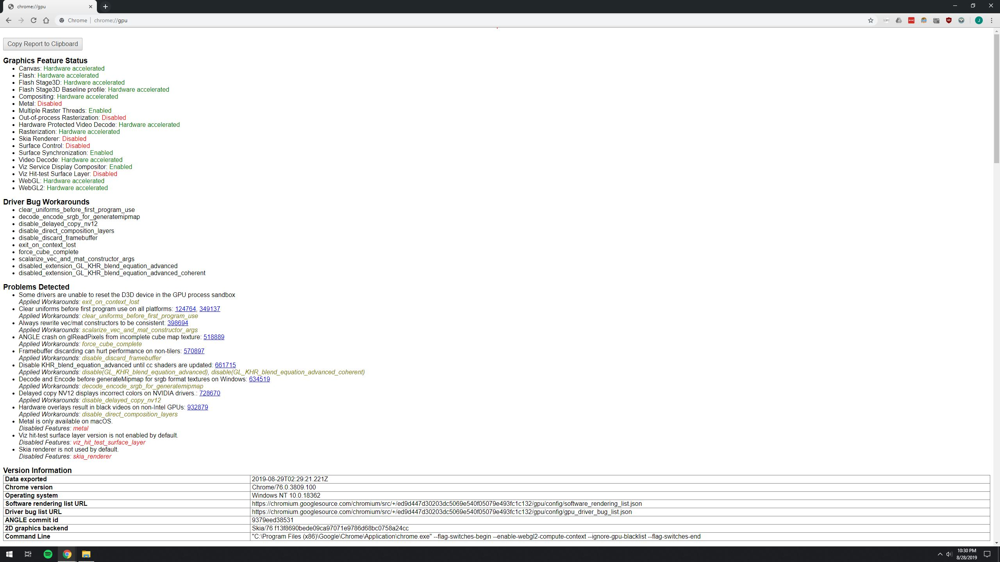
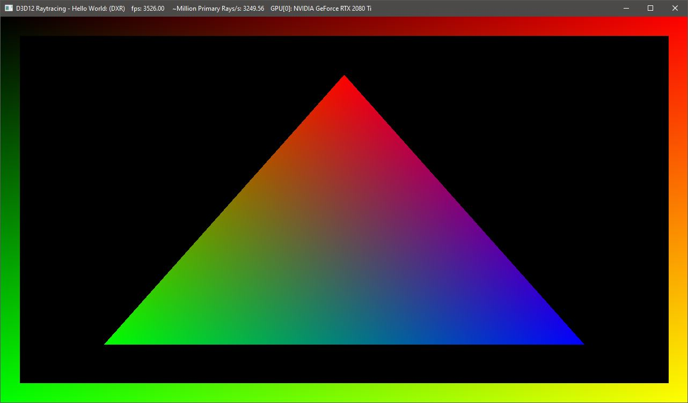
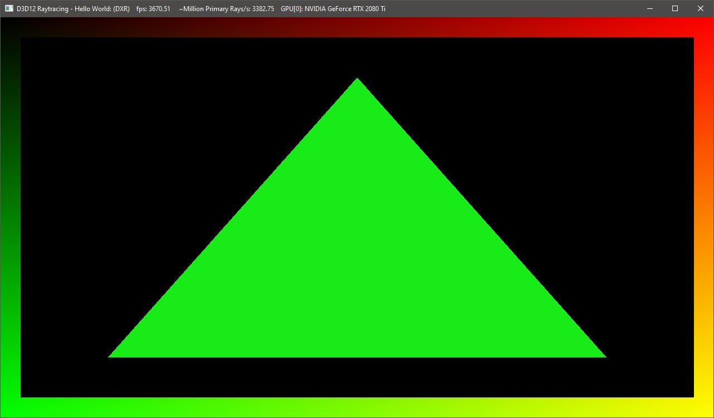
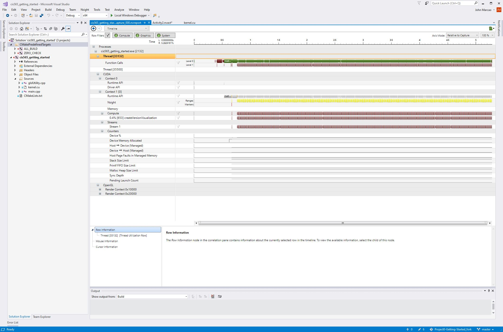

Project 0 - Getting Started
====================

**University of Pennsylvania, CIS 565: GPU Programming and Architecture, Project 0**

* John Marcao
  * [LinkedIn](https://www.linkedin.com/in/jmarcao/)
* Tested on: Windows 10, i5-4690K @ 3.50GHz, 8GB DDR3, RTX 2080 TI 3071MB (Personal)

## Overview
This project is straight-forward: setup a CUDA development environment and explore some the capabilities of the debugger.

## Enabling WebGL

WebGL was not enabled by default under Chrome, so I had to enable it under the `chome://flags` menu. The option was confirmed by checking the status of the `chrome://gpu` page.



## DXR Testing

The DXR-Config-Test folder contains a VS 2017 Project containing a DXR test utility. By building the and running the application and referring to the [README of the Microsoft Source](https://github.com/microsoft/DirectX-Graphics-Samples/blob/master/Samples/Desktop/D3D12Raytracing/src/D3D12RaytracingHelloWorld/readme.md) I was able to confirm that my machine was capable of using the DXR function. The first image below is the application with the default settings. The second image contains a modified image using the following change in D3D12RayTracingHelloWorld/Raytracing.hsl:72

```
...
//float3 barycentrics = float3(1 - attr.barycentrics.x - attr.barycentrics.y, attr.barycentrics.x, attr.barycentrics.y);
float3 barycentrics = float3(0.1, 0.92, 0.1);
...
```





## Build and Debug

The last section of the project involved building an application using the CUDA API and making a small modification. This is useful to prove that my machine can build and run CUDA-based application correctly. After building the application, I explored the NSight debugging and analysis tool. Using the tool I ran a performance analysis on the example application.



Lastly, I experimented with setting conditional breakpoints in the CUDA kernel code and analyzing the Warp Info. I set a breakpoiint to stop at the index value 1265. From there I opneded the Warp Info panel and examined the results. The first step is to figure out what on earth a "warp" is. According to NVidia, a warp is a group of threads that are all executing the same instructions at the same time, thus allowing the GPU to optimize the thread execution. This is better explained by NVidia...

> The benefits of SIMT for programmability led NVIDIA’s GPU architects to coin a new name for this architecture, rather than describing it as SIMD. NVIDIA GPUs execute warps of 32 parallel threads using SIMT, which enables each thread to access its own registers, to load and store from divergent addresses, and to follow divergent control flow paths. The CUDA compiler and the GPU work together to ensure the threads of a warp execute the same instruction sequences together as frequently as possible to maximize performance." [Link](https://devblogs.nvidia.com/using-cuda-warp-level-primitives/)

With this information, I can see that each row is one wrap, each with 32 threads. I can confirm that these are threads by clicking on the green boxes. This moves the arrow to the box and updates the auto varaibles in the debugger. From there I can see that the threadIdx changes for each thread, confirming my understanding. This is all very trivial, but further down the line this information will be crucial when debugging any issues in CUDA kernel code.


